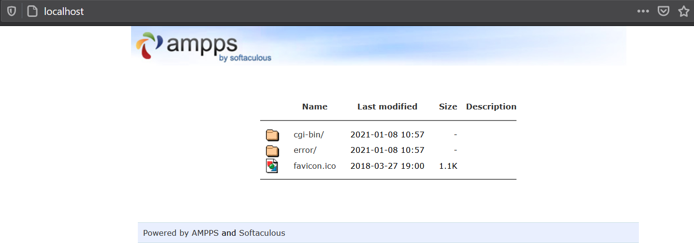
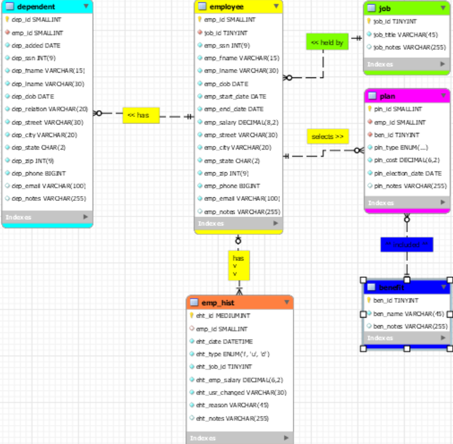

# LIS3781 Advanced Database Management

## Justin Davis

### Assignment #1 Requirements:

[comment]: <> (>*Sub-Heading:*)

1. Distributed Version Control Setup
2. Development Installation
3. Entity Relationship Diagram
4. Push your local repository to the one hosted by Bitbucket's servers: See *Part 1* (above)
5. Provide me with *read-only* access to Bitbucket repository: See *Part 1* (above)

### A1 Database Business Rules:

The human resource (HR) department of the ACME company wants to contract a database modeler/designer to collect the following employee data for tax purposes:job description, length of employment, benefits,number ofdependents and their relationships, DOB of both the employee and any respective dependents. In addition, employees’ histories mustbe tracked. Also, include the following business rules:

*  Each employee may have one or more dependent
*  Each employee has only one job
*  Each job can be held by many employees.
*  Many employees may receive many benefits.
*  Many benefitsmay be selected by many employees(though, while they may not select anybenefits—any dependentsof employees may be on anemployee’s plan).

## In Addition:

*  Employee:SSN, DOB, start/end dates, salary;
*  Dependent:same information as their associated employee(though, not start/end dates),date added(as dependent),type of relationship: e.g., father, mother, etc.
*  Job:title(e.g., secretary, service tech., manager, cashier, janitor, IT, etc.)
*  Benefit:name(e.g., medical, dental, long-term disability, 401k, term life insurance, etc.)
*  Plan:type(single, spouse, family), cost, election date(plans must be unique
*  Employee history:jobs, salaries, and benefit changes, as well as whomade the changeand why;
*  Zero Filled data: SSN, zip codes (not phone numbers: US area codesnot below 201, NJ)
*  *All* tables must include notesattribute.

#### README.md file should include the following items:

* Screenshot of ampps installation running (#1 above);
* git commands w/ short descriptions ("Lesson 3b - Version Control Systems: Course Configuration");
* *Your* ERD image
* Bitbucket repo Links:
* Git commands w/ short descriptions
* Bitbucket repo links:
    * a. This assignment, and
    * b. The completed tutorial repo above (bitbucketstationlocations).

[comment]: <> (> This is a blockquote.)
> 
[comment]: <> (> This is the second paragraph in the blockquote.)
>
#### Git commands w/short descriptions:

1. git-init - Create an empty Git repository or reinitialize an existing one
2. git-status - Show the working tree status
3. git-add - Add file contents to the index
4. git-commit - Record changes to the repository
5. git-push - Update remote refs along with associated objects
6. git-pull - Fetch from and integrate with another repository or a local branch
7. git-clone - Clone a repository into a new directory

#### Assignment Screenshots:

#### Tutorial Links:

*Bitbucket Tutorial - Station Locations:*
[A1 Bitbucket Station Locations Tutorial Link](https://bitbucket.org/jd19z/bitbucketstationlocations/ "Bitbucket Station Locations")