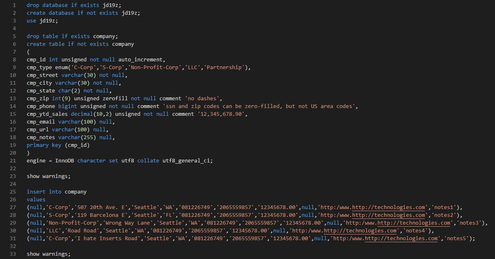
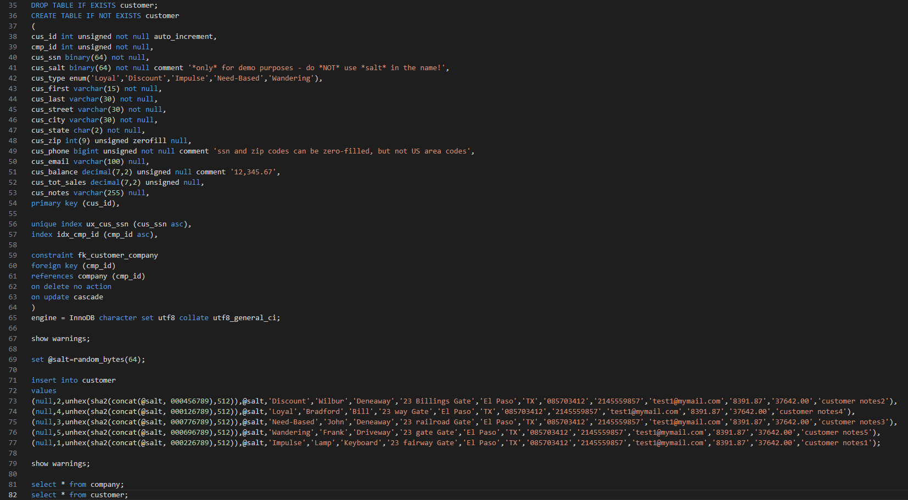
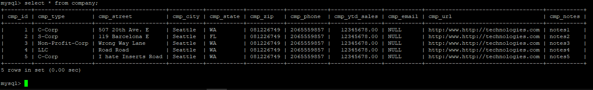
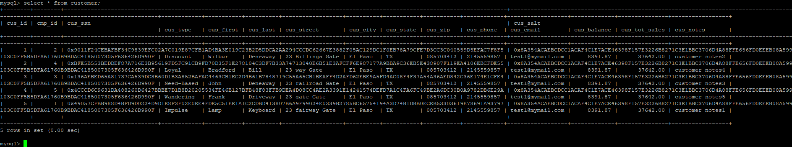

# LIS3781 Advanced Database Management

## Justin Davis

### Assignment #2 Requirements:

[comment]: <> (>*Sub-Heading:*)

1. Tables and insert statements.
2. Include indexes and foreign key SQL statements.
3. Include *your* query result sets, including grant statements.
4. The following tables should be created and populated with at least 5 records *both* locally and to the CCI server.
5. Provide me with *read-only* access to Bitbucket repository

#### README.md file should include the following items:

* Screenshot of *your* SQL Code.
* Screenshot of *your* populated tables.

#### Assignment Screenshots:

*Screenshot of SQL Code*:

 

*Screenshot of populated tables*:

 

#### Tutorial Links:

*Bitbucket Tutorial - Station Locations:*
[A1 Bitbucket Station Locations Tutorial Link](https://bitbucket.org/jd19z/bitbucketstationlocations/ "Bitbucket Station Locations")