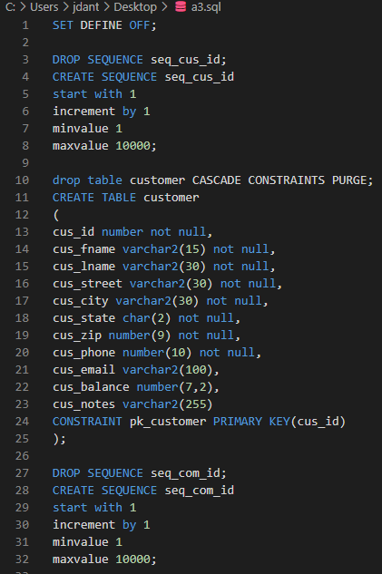
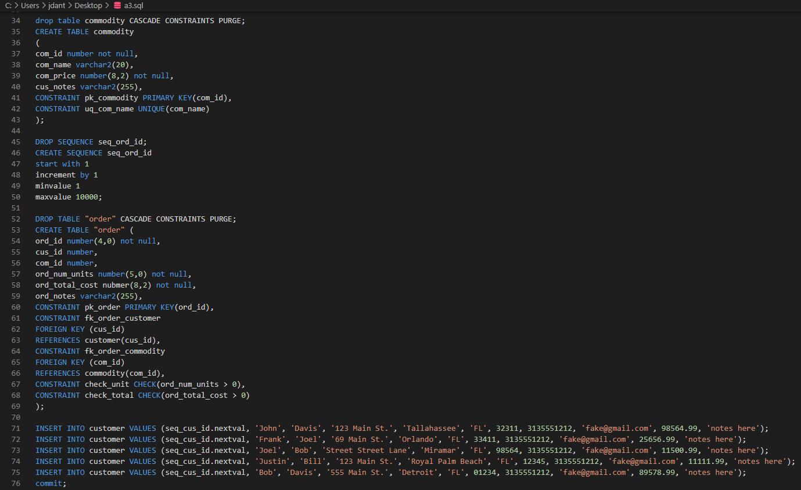
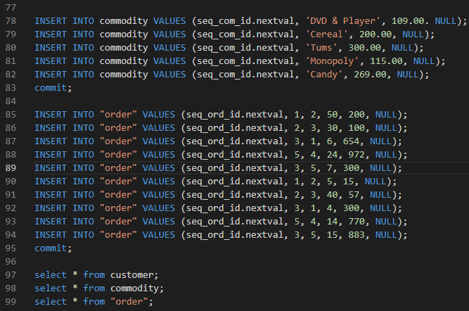
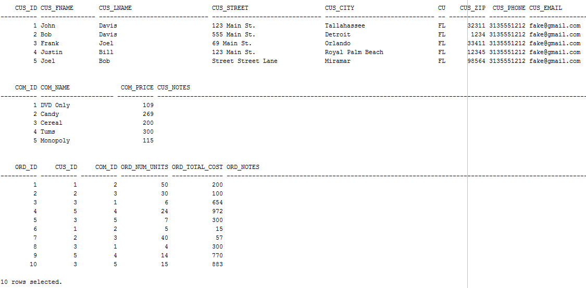

# LIS3781 Advanced Database Management

## Justin Davis

### Assignment #2 Requirements:

[comment]: <> (>*Sub-Heading:*)

1. Log into Oracle Server using RemoteLabs.
2. Create and populate Oracle tables.
3. Provide me with *read-only* access to Bitbucket repository

#### README.md file should include the following items:

* Screenshot of *your* SQL Code.
* Screenshot of *your* populated tables (w/in the Oracle environment).
* Optional: SQL code for the required reports.
* Bitbucket repo links: *Your* lis3781 Bitbucket repo link.

#### Assignment Screenshots:

*Screenshot of SQL Code*:

Screenshot One of SQL Code             |  Screenshot Two of SQL Code             | Screenshot Three of SQL Code             
:-------------------------:|:-------------------------:|:------------------------------------------------:
  |    | 

*Screenshot of populated tables*:

#### Tutorial Links:

*Bitbucket Tutorial - Station Locations:*
[A1 Bitbucket Station Locations Tutorial Link](https://bitbucket.org/jd19z/bitbucketstationlocations/ "Bitbucket Station Locations")