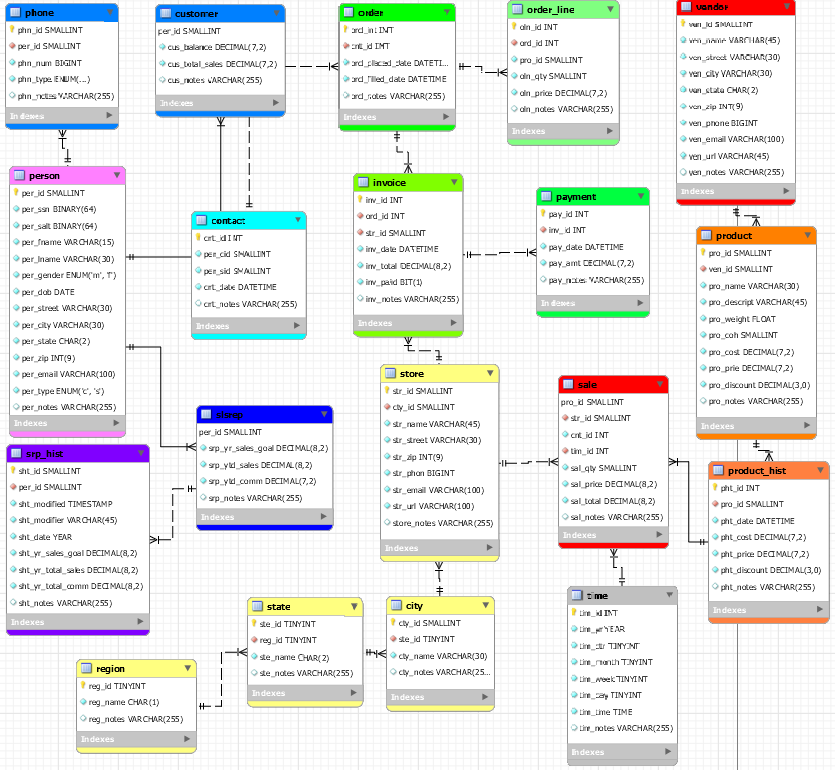

# LIS3781 Advanced Database Management

## Justin Davis

### Assignment #5 Requirements:

[comment]: <> (>*Sub-Heading:*)

1. Using RemoteLabs, log into SQL Server
2. Populate using T-SQL *or* Table Designer
3. *FK:* Must require ON DELETE CASCADE, ON UPDATE CASCADE
4. Include at least 25 *unique* records in the sale table, and at least 5 *unique* records in all other tables.

#### README.md file should include the following items:

* Screenshot of *your* ERD
* Optional: SQL code for required reports
* Bitbucket repo links: *Your* lis3781 Bitbucket repo link

#### Assignment Screenshots:

#### Tutorial Links:

*Bitbucket Tutorial - Station Locations:*
[A1 Bitbucket Station Locations Tutorial Link](https://bitbucket.org/jd19z/bitbucketstationlocations/ "Bitbucket Station Locations")