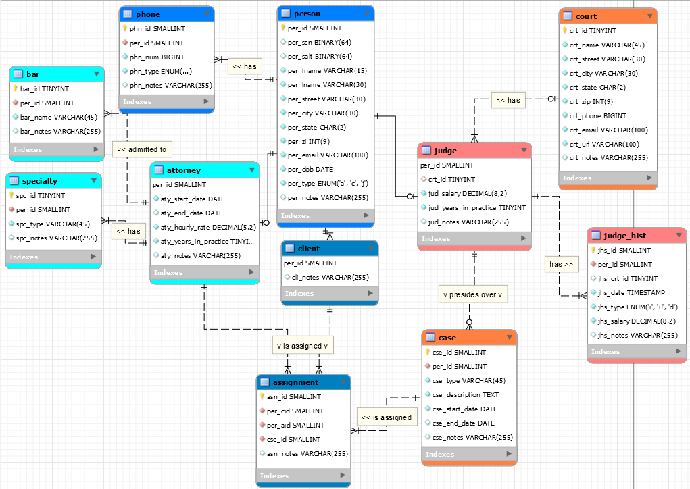

# LIS3781 Advanced Database Management

## Justin Davis

### Assignment P1 Requirements:

1. ERD (in .mwb format).
2. SQL Statement Questions.
3. Include 15 records in the person table and 5 records in all other tables.

#### README.md file should include the following items:

* Screnshot of *your* ERD.
* Optional: SQL code for the required reports.
* Bitbucket repo links: *Your* lis3781 Bitbucket repo link.

#### Assignment Links:

*P1 SQL Code*:

[P1 .SQL File](docs/lis3781_p1_solutions.sql)

#### Assignment Screenshots:

*Screenshot of P1 ERD*:

#### Tutorial Links:

*Bitbucket Tutorial - Station Locations:*
[A1 Bitbucket Station Locations Tutorial Link](https://bitbucket.org/username/bitbucketstationlocations/ "Bitbucket Station Locations")