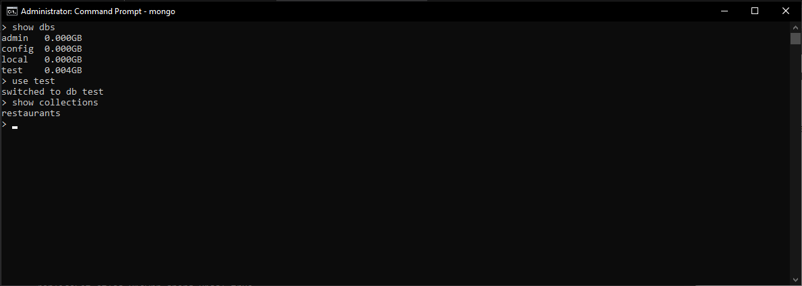

# LIS3781 Advanced Database Management

## Justin Davis

### Assignment P2 Requirements:

1. *Import data into the collection: Place primer-dataset.json in bin directory!*
2. Complete all queries from restaurant collection in test db
3. Provide *Bitbucket* read-only access to *course* repo

#### README.md file should include the following items:

* *Screenshot* of at least one MongoDB shell command(s), (e.g., show collections)
* *Optional:* JSON code for the required reports
* Bitbucket repo links: *Your* lis3781 Bitbucket repo link.

#### Assignment Links:

*P2 JSON Code*:

[P2 JSON](docs/p2_code.js)

#### Assignment Screenshots:

*Screenshot of MongoDB Command*:

#### Tutorial Links:

*Bitbucket Tutorial - Station Locations:*
[A1 Bitbucket Station Locations Tutorial Link](https://bitbucket.org/username/bitbucketstationlocations/ "Bitbucket Station Locations")